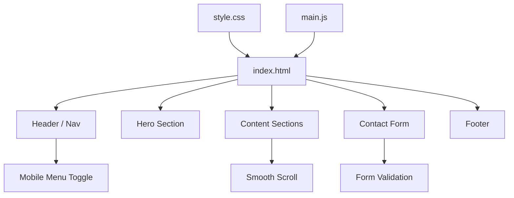
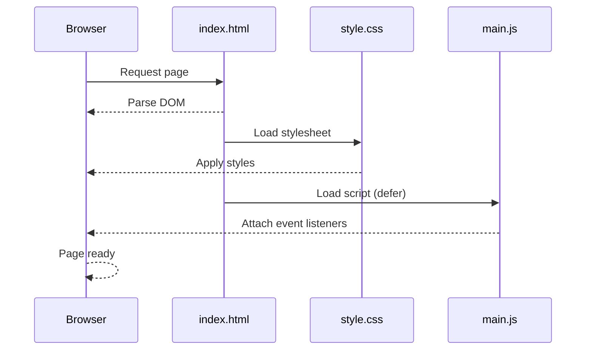
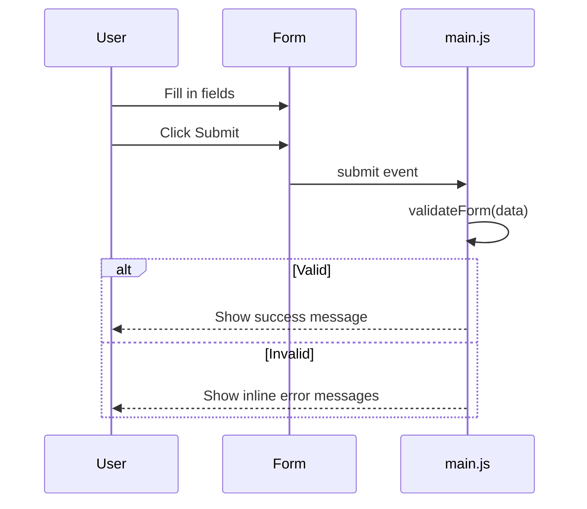

# Design Document: Simple Website

## Overview

A clean, easy-to-use static website built with HTML5, CSS, and vanilla JavaScript. The site features a responsive layout with a navigation bar, hero section, content sections, and a contact form — all without any external frameworks or dependencies.

The design prioritizes simplicity, accessibility, and fast load times. JavaScript is used only for interactive enhancements (mobile menu toggle, form validation, smooth scroll) so the site remains functional even without JS.

## Architecture



## Sequence Diagrams

### Page Load Flow



### Form Submission Flow



## Components and Interfaces

### Component 1: Navigation Bar

**Purpose**: Site-wide navigation with responsive mobile menu

**Interface**:
```html
<nav id="navbar">
  <a class="logo" href="#">SiteName</a>
  <ul class="nav-links">
    <li><a href="#about">About</a></li>
    <li><a href="#services">Services</a></li>
    <li><a href="#contact">Contact</a></li>
  </ul>
  <button class="menu-toggle" aria-label="Toggle menu">&#9776;</button>
</nav>
```

**Responsibilities**:
- Render navigation links
- Toggle mobile menu open/closed
- Highlight active section on scroll

### Component 2: Hero Section

**Purpose**: First visible section with a headline and call-to-action

**Interface**:
```html
<section id="hero">
  <h1 class="hero-title">Welcome</h1>
  <p class="hero-subtitle">A short tagline here</p>
  <a href="#contact" class="btn-primary">Get Started</a>
</section>
```

**Responsibilities**:
- Display primary headline and CTA
- Full-viewport height layout

### Component 3: Content Sections

**Purpose**: Reusable sections for About, Services, etc.

**Interface**:
```html
<section id="about" class="section">
  <div class="container">
    <h2>About</h2>
    <p>Content goes here.</p>
  </div>
</section>
```

**Responsibilities**:
- Display structured content
- Consistent spacing and typography

### Component 4: Contact Form

**Purpose**: User input form with client-side validation

**Interface**:
```html
<form id="contact-form" novalidate>
  <input type="text"  id="name"    name="name"    required />
  <input type="email" id="email"   name="email"   required />
  <textarea           id="message" name="message" required></textarea>
  <button type="submit">Send</button>
</form>
```

**Responsibilities**:
- Collect name, email, message
- Validate fields before submission
- Show success or error feedback

## Data Models

### FormData

```javascript
// Shape of data collected from the contact form
const formData = {
  name: String,    // required, non-empty
  email: String,   // required, valid email format
  message: String  // required, non-empty
}
```

**Validation Rules**:
- `name`: must be non-empty string
- `email`: must match `/^[^\s@]+@[^\s@]+\.[^\s@]+$/`
- `message`: must be non-empty string

### ValidationResult

```javascript
const validationResult = {
  valid: Boolean,
  errors: {
    name: String | null,
    email: String | null,
    message: String | null
  }
}
```

## Algorithmic Pseudocode

### Main Initialization Algorithm

```pascal
ALGORITHM initPage()
INPUT: DOM ready event
OUTPUT: event listeners attached

BEGIN
  navToggle ← document.querySelector('.menu-toggle')
  navLinks  ← document.querySelector('.nav-links')
  form      ← document.querySelector('#contact-form')

  ATTACH onClick(navToggle) → toggleMenu(navLinks)
  ATTACH onSubmit(form)     → handleFormSubmit(form)
  ATTACH onScroll(window)   → highlightActiveNav()
END
```

### Form Validation Algorithm

```pascal
ALGORITHM validateForm(data)
INPUT: data { name, email, message }
OUTPUT: ValidationResult { valid, errors }

BEGIN
  errors ← { name: null, email: null, message: null }

  IF data.name IS empty THEN
    errors.name ← "Name is required"
  END IF

  IF data.email IS empty THEN
    errors.email ← "Email is required"
  ELSE IF data.email does NOT match emailRegex THEN
    errors.email ← "Enter a valid email address"
  END IF

  IF data.message IS empty THEN
    errors.message ← "Message is required"
  END IF

  valid ← (errors.name = null AND errors.email = null AND errors.message = null)

  RETURN { valid, errors }
END
```

**Preconditions:**
- `data` is a plain object with `name`, `email`, `message` string fields

**Postconditions:**
- Returns `valid: true` only when all three fields pass their rules
- `errors` object contains `null` for passing fields and a string message for failing fields
- No mutations to input `data`

### Mobile Menu Toggle Algorithm

```pascal
ALGORITHM toggleMenu(navLinks)
INPUT: navLinks element
OUTPUT: menu visibility toggled

BEGIN
  IF navLinks has class 'open' THEN
    REMOVE class 'open' FROM navLinks
  ELSE
    ADD class 'open' TO navLinks
  END IF
END
```

**Preconditions:** `navLinks` is a valid DOM element

**Postconditions:** `navLinks` class list contains 'open' XOR it did before the call

## Key Functions with Formal Specifications

### validateForm(data)

```javascript
function validateForm(data) { ... }
```

**Preconditions:**
- `data` is a non-null object
- `data.name`, `data.email`, `data.message` are strings (may be empty)

**Postconditions:**
- Returns `ValidationResult`
- `result.valid === true` iff all fields pass validation
- `result.errors[field]` is `null` when field is valid, string when invalid
- `data` is not mutated

**Loop Invariants:** N/A (no loops)

### handleFormSubmit(event)

```javascript
function handleFormSubmit(event) { ... }
```

**Preconditions:**
- `event` is a valid form submit Event
- Form element contains `name`, `email`, `message` inputs

**Postconditions:**
- Default form submission is prevented
- If valid: success message shown, form reset
- If invalid: error messages displayed next to relevant fields

### highlightActiveNav()

```javascript
function highlightActiveNav() { ... }
```

**Preconditions:**
- Page has sections with `id` attributes matching nav `href` anchors

**Postconditions:**
- At most one nav link has the `active` class at any time
- The `active` link corresponds to the section currently in the viewport

## Example Usage

```javascript
// Initialize on DOM ready
document.addEventListener('DOMContentLoaded', initPage)

// Validate form data
const result = validateForm({ name: 'Alice', email: 'alice@example.com', message: 'Hello' })
// result → { valid: true, errors: { name: null, email: null, message: null } }

const bad = validateForm({ name: '', email: 'not-an-email', message: '' })
// bad → { valid: false, errors: { name: 'Name is required', email: 'Enter a valid email address', message: 'Message is required' } }

// Toggle mobile menu
toggleMenu(document.querySelector('.nav-links'))
```

## Correctness Properties

*A property is a characteristic or behavior that should hold true across all valid executions of a system — essentially, a formal statement about what the system should do. Properties serve as the bridge between human-readable specifications and machine-verifiable correctness guarantees.*

### Property 1: Valid inputs always produce a passing ValidationResult

For any FormData where `name.trim()` is non-empty, `email` matches `/^[^\s@]+@[^\s@]+\.[^\s@]+$/`, and `message.trim()` is non-empty, calling `validateForm` SHALL return a ValidationResult with `valid === true` and all `errors` fields equal to `null`.

**Validates: Requirements 4.2**

### Property 2: Empty or malformed inputs always produce a failing ValidationResult

For any FormData where at least one of `name` is empty, `email` is malformed, or `message` is empty, calling `validateForm` SHALL return a ValidationResult with `valid === false` and a non-null error string for each failing field.

**Validates: Requirements 4.3, 4.4, 4.5**

### Property 3: validateForm never mutates its input

For any FormData object passed to `validateForm`, the values of `name`, `email`, and `message` on that object SHALL be identical before and after the call.

**Validates: Requirements 4.8**

### Property 4: At most one nav link is active at any scroll position

For any scroll position on the Page, the count of NavLink elements carrying the `active` CSS class SHALL be zero or one.

**Validates: Requirements 1.4, 1.5**

### Property 5: Menu toggle is a strict state flip (round-trip)

For any initial state of the NavLinks element, calling `toggleMenu` twice in succession SHALL leave the `open` class membership identical to its state before the first call.

**Validates: Requirements 1.2, 1.3**

## Error Handling

### Error Scenario 1: Invalid Form Input

**Condition**: User submits form with empty or malformed fields
**Response**: Inline error messages appear below each invalid field; form is not submitted
**Recovery**: User corrects fields and resubmits

### Error Scenario 2: Missing DOM Elements

**Condition**: Expected elements (nav, form) not found in DOM
**Response**: JS guards with null checks prevent runtime errors; page remains functional
**Recovery**: Graceful degradation — static HTML still works

## Testing Strategy

### Unit Testing Approach

Test `validateForm` in isolation with a variety of inputs:
- All valid inputs → `valid: true`
- Empty name → error on `name`
- Invalid email formats → error on `email`
- Empty message → error on `message`
- All empty → all three errors present

### Property-Based Testing Approach

**Property Test Library**: fast-check

- For any string `name` where `name.trim() !== ''`, `email` matching the regex, and non-empty `message` → `validateForm` returns `valid: true`
- For any empty `name` → `validateForm` always returns `valid: false`
- `toggleMenu` called twice on the same element always returns it to its original state

### Integration Testing Approach

- Load `index.html` in a browser/jsdom environment
- Simulate form submit with valid data → assert success message visible
- Simulate form submit with invalid data → assert error messages visible
- Simulate mobile viewport → assert menu toggle works correctly

## Performance Considerations

- No external JS libraries or CSS frameworks — zero network overhead beyond the three files
- CSS uses custom properties (variables) for theming to avoid redundant declarations
- JS is loaded with `defer` to avoid blocking HTML parsing
- Images (if any) should use `loading="lazy"` and be appropriately sized

## Security Considerations

- Form uses `novalidate` so JS validation runs, but HTML5 native validation is a fallback
- Any future server-side submission must sanitize inputs to prevent XSS/injection
- No sensitive data is stored client-side
- External links should use `rel="noopener noreferrer"`

## Dependencies

- None — pure HTML5, CSS3, and vanilla JavaScript
- No build tools required; files can be served directly from any static host
